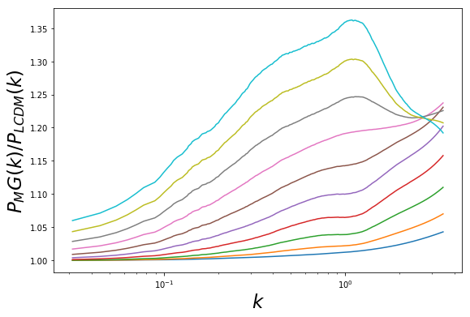

# Emulator for fast generation of *P<sub>MG</sub>(k)/P<sub>LCDM</sub>(k)* for *f(R)* Hu-Sawicki model


## Requirements

The emulator is developed using the following packages:

- python 3.7
1. tensorflow==1.14.0 `pip install tensorflow==1.14.0`
2. gpflow=1.5.1 `pip install gpflow==1.5.1`
3. scikit-learn=0.21.3 `pip install scikit-learn`


## Installation

To install the package in developer mode, clone the git repo locally and then use a pip development installation by running

```
git clone https://github.com/LSSTDESC/mgemu.git
cd mgemu
python setup.py install --user   # Add --user flag to install it locally
```
from the top-level of the repo. From the same directory, run the test suite
```
pytest
```


## Running the Emulator 
A script for running the emulator is also provided in `mgemu/notebooks/'

### Import the Emulator 

```
from mgemu import emu
```

### Define the Cosmological Parameters

```
# LCDM parameters
h = 0.67 # See notes regarding the value of h below
Om=(h**2)*0.281
ns=0.971
s8=0.82

# Hu-Sawicki model parameters
fr0 = 1e-5
n=1

# Redshift
z= 0.3
```

### Run the Emulator
```
pkratio, k = emu(Om=Om, ns=ns, s8=s8, fR0=fr0, n=n, z=z)
```


### Plotting the power spectra ratios should provide




## Important notes: 

1. The emulator is trained within the range:

- 0.12 ≤ Ω<sub>m</sub>h<sup>2</sup> ≤ 0.15
- 0.85 ≤ n<sub>s</sub> ≤ 1.1
- 0.7≤ σ<sub>8</sub> ≤0.9
- 10<sup>−8</sup> ≤ f<sub>R<sub>0</sub></sub> ≤10<sup>−4</sup>
- 0 ≤ n ≤4
- 0 ≤ z ≤ 49

Hence the estimation is only reliable in this range. Outside of this, the GP performs extrapolation, and may provide unreliable results. 

2. Emulator is trained with COLA simulations with h = 0.67, in agreement with Planck. For small differences of h, the emulator output does not vary much. However the user must exercise caution, and limit the use of h = 0.67 as much as possible. 

3. Output from the `mgemu.emu` function will be the binned power spectra enhancement *P<sub>MG</sub>(k)/P<sub>LCDM</sub>(k)* and wavenumber *k* in 213 bins. 

4. Although the k range of the emulator is up to 0 ≤ k ≤ 3.5 h/Mpc, we do not advocate the use of the emulator for small scales beyond  k ~ 1.0 h/Mpc.

## License and Feedback:

This software was developed within the LSST DESC using LSST DESC resources, and so meets the criteria given in, and is bound by, the LSST DESC Publication Policy for being a “DESC product”.

The list of released versions of this package can be found [here](https://github.com/LSSTDESC/mgemu/releases), with the master branch including the most recent (non-released) development.

This repository is maintained by Georgios Valogiannis [(@gvalgioa)](https://github.com/gvalogia) and Nesar Ramachandra [(@nesar)](https://github.com/gvalogia). If you have comments, suggestions or questions, please write us an [issue](https://github.com/LSSTDESC/mgemu/issues).

This is open source software, available for re-use under the modified BSD license.
